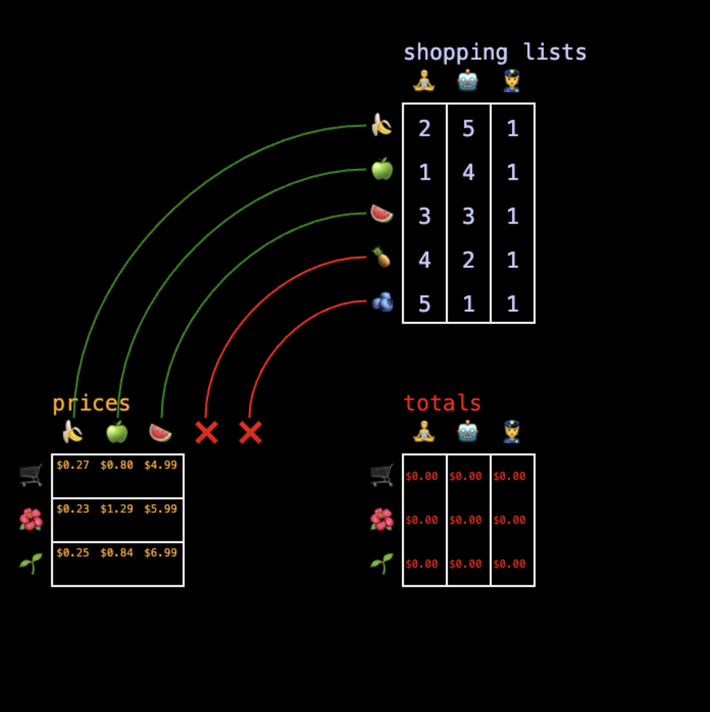

# Matmul viz
[Matmul viz](https://evanburnette.github.io/matmul_viz/) is an interactive tool to help people gain intuition about matrix multiplication.

It is based on [A Programmer’s Intuition for Matrix Multiplication](https://betterexplained.com/articles/matrix-multiplication/). In this article each matrix of the matmul contains either data or operations and the data is poured into the operations one column vector at a time. Each operation is a dot product (i.e. element wise multiplication and then a sum of the results). This result is then placed back below the original data, as new data.

This program takes something most people are familiar with, a receipt, and turns it into a matmul problem. Each shopper has a different shopping list, and they want to know which store they should shop at to spend the least amount of money. So we use a dotproduct to multiply the number of items of each kind with the price of each kind of item. That gives us their receipt. The total of this receipt goes into the result matrix so now we have a matrix of shoppers vs stores and it's easy to see which store the shopper should shop at to get the lowest total.

This program visualizes all the intermediate steps that the matmul operation takes rather than hand waving the details away.

Additionally, it shows the output matrix in an orientation where it is clear why you can only multiply compatible matrices together. The number of rows of the data matrix must match the number of columns of the operations matrix.

Try it yourself! Click total cells to see their upstream dependencies and resize the input matrices to gain your own intuitions for why we need certain input dimensions to match while others are flexible!

[evanburnette.github.io/matmul_viz](https://evanburnette.github.io/matmul_viz/)
